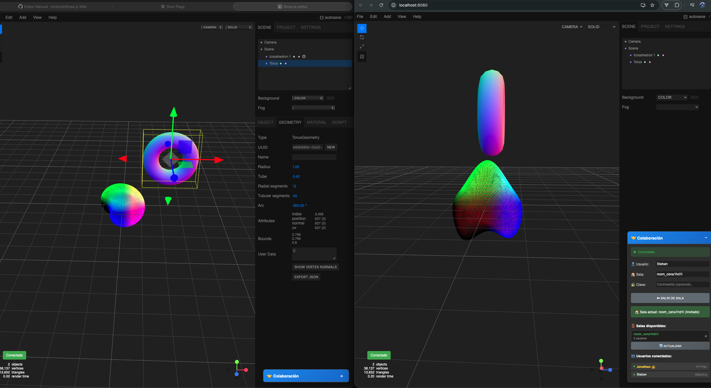

# ThreeLinker

Public server: https://linker.genodev.com.co/

ThreeLinker is a Three.js editor with real-time collaboration capabilities. It is a standalone version of the official Three.js editor that allows multiple users to work together on 3D scenes simultaneously.



## 🌟 Key Features

### Full 3D Editor
- **Interactive visual editor** to create and edit 3D scenes
- **Real-time viewport** with intuitive camera controls
- **Properties panel** to modify objects, materials, and geometries
- **Scripting system** with integrated code editor (CodeMirror)
- **Command history** with undo/redo functionality
- **Import/Export** of models and scenes

### Supported Geometries
- Basic geometries: Box, Sphere, Cylinder, Plane, etc.
- Advanced geometries: Torus, Dodecahedron, Icosahedron, etc.
- Custom geometries: Extrude, Lathe, Tube, Shape, etc.
- Geometry modifiers

### Materials and Shaders
- Standard Three.js materials
- Integrated GLSL shader editor
- Material properties system
- Texture and map support

### 🤝 Real-Time Collaboration
- **Collaboration rooms** – Create or join rooms to work as a team
- **Automatic synchronization** – All changes are instantly synchronized
- **Collaborative cursors** – See where other users are working
- **Integrated chat** – Communicate with your team while working
- **User management** – Name and role system
- **Connection states** – Visual information about collaboration status

## 🚀 Installation and Usage

### Prerequisites
- Node.js (version 18 or higher)
- Docker and Docker Compose (for production mode)
- Redis (optional, in-memory fallback available)

### Installation

1. Clone the repository:
```bash
git clone https://github.com/bscantor23/ThreeLinker.git
cd ThreeLinker

three-linker/
├── js/                          # Main editor code
│   ├── Editor.js               # Core editor class
│   ├── Viewport.js             # 3D viewport
│   ├── Sidebar.js              # Side panel
│   ├── Menubar.js              # Menu bar
│   ├── CollaborationManager.js # Collaboration management
│   ├── CollaborationPanel.js   # Collaboration UI panel
│   └── ...                     # Other modules
├── server/                      # Collaboration server
│   ├── collaborationServer.js  # Main server configuration
│   ├── managers/               # Room, user managers, etc.
│   ├── handlers/               # Event handlers
│   └── utils/                  # Server utilities
├── css/                        # Styles
├── examples/                   # Example scenes
├── images/                     # Graphic assets
├── index.html                  # Main page
├── server.js                   # Server entry point
└── package.json               # Project configuration
